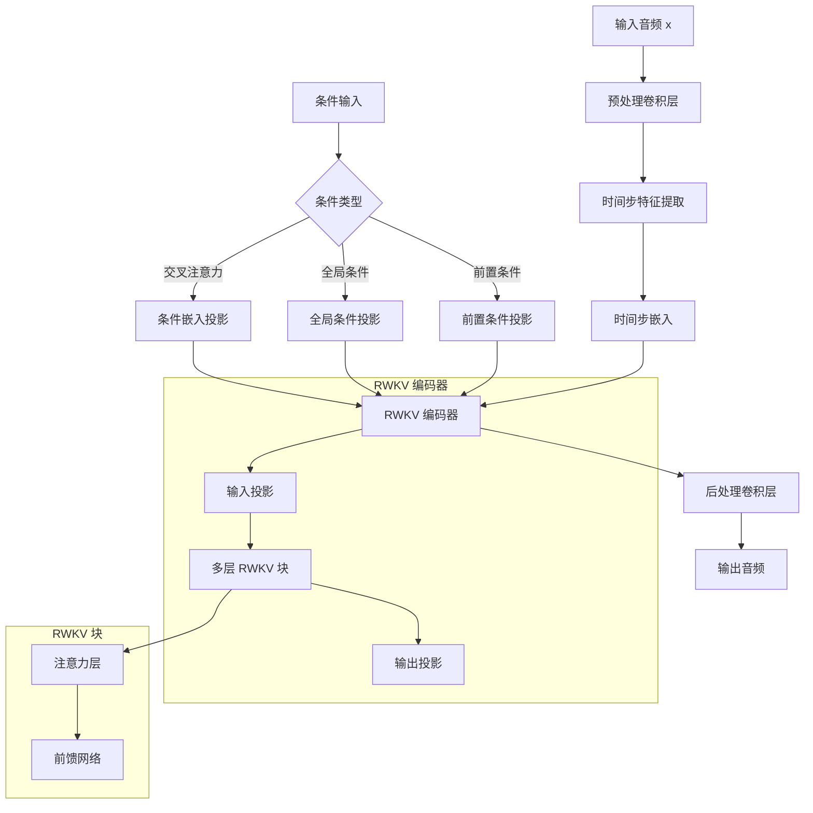

# The architect of Diffusion of RWKV 

The diagram looks like:


# The architect of ContinuousRWKV

The ContinuousRWKV is the model to handle continuous signals only model. The architect looks like:
```mermaid
graph TD
    A[输入 x] --> B[输入投影层]
    B --> C[多层 RWKV 块]
    C --> D[输出投影层]
    D --> E[输出]
    
    F[条件输入 context] --> C
    G[全局条件] --> C
    
    subgraph RWKV 块
        C --> H[预归一化]
        H --> I[RWKV7Attention]
        I --> J[前馈网络]
        J --> K{是否有 context?}
        
        subgraph 交叉注意力处理
            K -->|是| L{交叉注意力模式}
            L -->|transformer| M[Transformer 交叉注意力]
            L -->|rwkv| N[RWKV 交叉注意力]
            
            M --> O[条件归一化]
            N --> O
            O --> P[条件缩放]
            P --> Q[添加到主路径]
        end
        
        K -->|否| R[跳过交叉注意力]
        R --> S[输出]
        Q --> S
    end
    
    subgraph 全局条件处理
        G --> T{是否使用全局条件?}
        T -->|是| U[全局条件嵌入器]
        T -->|否| V[跳过全局条件]
        U --> C
        V --> C
    end